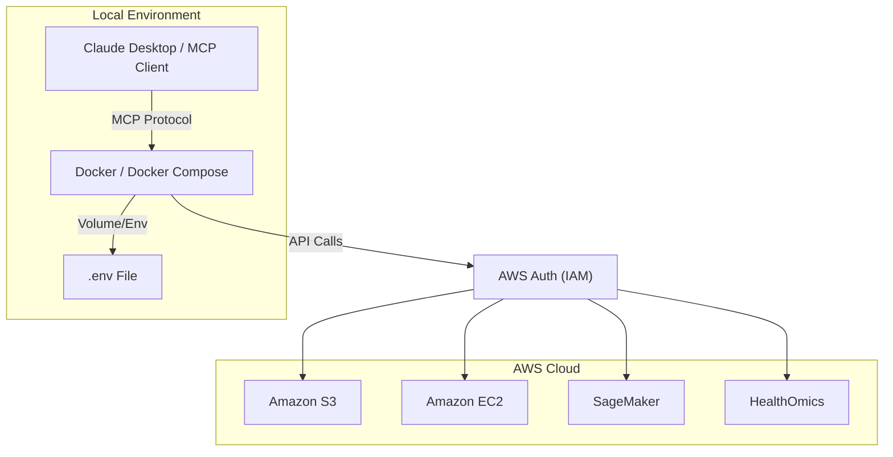

# 🚀 AWS Core MCP Server - Docker Compose Setup

[](https://www.docker.com/)
[](https://aws.amazon.com/)
[](https://modelcontextprotocol.io/)

Complete Docker Compose setup for running the **AWS Core MCP Server**. This project enables seamless interaction with AWS services through natural language using the Model Context Protocol (MCP).

---

## 📖 Table of Contents

- [🎯 Project Goal](#-project-goal)
- [🏗️ Architecture](#-architecture)
- [📋 Prerequisites](#-prerequisites)
- [🚀 Quick Start](#-quick-start)
- [📁 Project Structure](#-project-structure)
- [🔌 Integration with Claude Desktop](#-integration-with-claude-desktop)
- [🧪 Testing Your Setup](#-testing-your-setup)
- [🧬 Example Use Cases](#-example-use-cases)
- [🔒 Security Best Practices](#-security-best-practices)
- [🐛 Troubleshooting](#-troubleshooting)
- [📊 Monitoring and Logs](#-monitoring-and-logs)
- [🔄 Updates](#-updates)
- [📚 Additional Resources](#-additional-resources)

---

## 🎯 Project Goal

This Docker Compose setup provides an easy-to-use interface for interacting with AWS services through the Model Context Protocol (MCP). It is specifically optimized for:

*   **GPU Cluster Management**: Provisioning and managing GPU instances for training biological language models.
*   **Genomics & HealthOmics**: Managing S3 buckets, EC2 instances, and SageMaker jobs for specialized research.
*   **AI-Assisted Operations**: Using Claude or other MCP clients to interact with AWS through natural language.

---

## 🏗️ Architecture



---

## 📋 Prerequisites

Before you begin, ensure you have:

*   [x] **Docker & Docker Compose**: Installed and running ([Download Docker Desktop](https://www.docker.com/products/docker-desktop/)).
*   [x] **AWS Account**: An active account with necessary credits.
*   [x] **IAM User**: Created with `AdministratorAccess` (for initial setup) or specific limited permissions.
*   [x] **Access Keys**: Your `AWS_ACCESS_KEY_ID` and `AWS_SECRET_ACCESS_KEY`.

---

## 🚀 Quick Start

### 1. Clone or Download
```bash
# Create and enter project directory
mkdir aws-mcp-server && cd aws-mcp-server
# (Copy these files into the directory)
```

### 2. Configure Environment
```bash
cp .env.example .env
# Edit .env and add your AWS credentials
```

### 3. Launch Server
```bash
# Pull the latest image (as there is no local build required)
docker-compose pull

# Start services
docker-compose up -d
```

### 4. Verify Connection
```bash
docker-compose exec aws-core-mcp-server aws sts get-caller-identity
```

---

## 📁 Project Structure

```text
.
├── docker-compose.yaml    # Docker Compose orchestration
├── .env                  # Environment secrets (IGNORED BY GIT)
├── .env.example          # Template for credentials
├── .gitignore           # Git safety rules
├── mcp.json             # Direct Docker run configuration
└── README.md            # Documentation (You are here)
```

---

## 🔌 Integration with Claude Desktop

### Option 1: Using Docker Compose (Recommended)

Add this to your `claude_desktop_config.json`:

```json
{
  "mcpServers": {
    "aws-core-mcp-server": {
      "command": "docker",
      "args": [
        "compose",
        "-f",
        "/absolute/path/to/aws-mcp-server/docker-compose.yaml",
        "run",
        "--rm",
        "aws-core-mcp-server"
      ]
    }
  }
}
```

> [!IMPORTANT]
> Always use the **absolute path** to your `docker-compose.yaml` file. You can find it by running `pwd` in the project directory.

### Option 2: Direct Docker Run

```json
{
  "mcpServers": {
    "aws-core-mcp-server": {
      "command": "docker",
      "args": [
        "run",
        "-i",
        "--rm",
        "--env-file",
        "/absolute/path/to/aws-mcp-server/.env",
        "mcp/aws-core-mcp-server"
      ]
    }
  }
}
```

---

## 🧪 Testing Your Setup

| Test | Command | What it Verifies |
| :--- | :--- | :--- |
| **Identity** | `docker-compose exec aws-core-mcp-server aws sts get-caller-identity` | Valid AWS credentials |
| **S3** | `docker-compose exec aws-core-mcp-server aws s3 ls` | Access to storage |
| **Regions** | `docker-compose exec aws-core-mcp-server aws ec2 describe-regions` | Network & API access |

---

## 🧬 Example Use Cases

### 1. Provision Research Infrastructure
> "Create an S3 bucket named `research-data-2025` in `us-east-1` and set up a SageMaker notebook instance for analysis."

### 2. Manage Genomics Data
> "List all HealthOmics sequence stores and summarize the available datasets."

### 3. GPU Instance Management
> "Check if I have any running p4d.24xlarge instances and show their current status."

---

## 🔒 Security Best Practices

> [!WARNING]
> **Never commit your `.env` file!** It contains sensitive AWS credentials that could lead to unauthorized account access if leaked.

1.  **Restrict Permissions**: Use an IAM user with only the permissions required for your specific tasks (Principle of Least Privilege).
2.  **Rotate Keys**: Regularly rotate your AWS access keys (e.g., every 90 days).
3.  **Use MFA**: Enable Multi-Factor Authentication for your AWS account root and IAM users.
4.  **Local Isolation**: Ensure your `.env` file has restricted permissions: `chmod 600 .env`.

---

## 🐛 Troubleshooting

*   **Error: "docker: command not found"**: Ensure Docker Desktop is installed and path is configured.
*   **Error: "Permission denied"**: On Linux, add your user to the `docker` group: `sudo usermod -aG docker $USER`.
*   **Error: "Unable to locate credentials"**: Check that `.env` exists and contains valid values. Restart with `docker-compose restart`.
*   **Warning: "No services to build"**: This is expected! This project uses pre-built images from Docker Hub. Use `docker-compose pull` to update instead of `build`.
*   **Container keeps restarting**: Check logs with `docker-compose logs -f`.

---

## 📊 Monitoring and Logs

```bash
# View last 100 lines of logs
docker-compose logs --tail=100 -f

# Check container resource usage
docker stats aws-mcp-server
```

---

## 🔄 Updates

To update to the latest version of the AWS Core MCP Server:

```bash
docker-compose pull
docker-compose up -d
```

---

## 📚 Additional Resources

*   [Model Context Protocol](https://modelcontextprotocol.io/)
*   [AWS CLI Command Reference](https://docs.aws.amazon.com/cli/latest/reference/)
*   [AWS HealthOmics Guide](https://docs.aws.amazon.com/omics/)

---

**Last Updated:** February 7, 2026
**Version:** 1.1.0